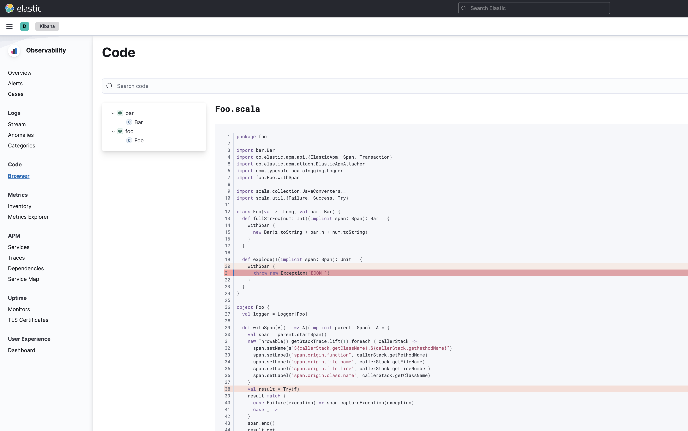
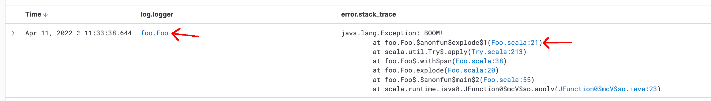
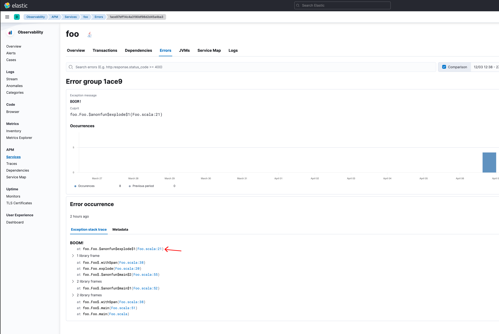
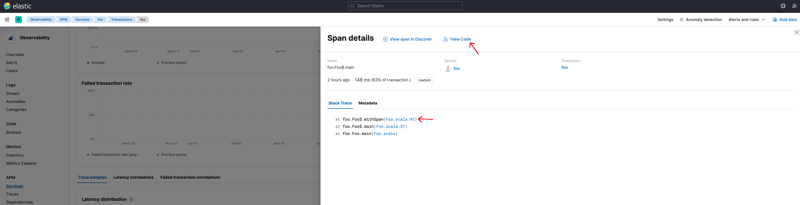

# Search code with Elasticsearch

This is a small demo of what could be achieved by indexing source code into Elasticsearch. The demo shows how the source can be integrated with existing observability features in Kibana. E.g. stack traces in Discover plugin and APM errors that link back to the code.

## Running the demo

1. Start the stack
   ```
   docker-compose -f example/docker-compose.yml up -d
   ```
2. Check out the [demo Kibana branch](https://github.com/s-nel/kibana/tree/code-search-modifications)
3. Mount the Kibana plugin into the Kibana repository
   ```
   ln -s <kibana-path>/scode <code-search-path>/kibana-plugin
   ```
4. Start Kibana
   ```
   yarn start
   ```
5. Run the example project. This also indexes the source code into the Elasticsearch container and generates some logs that are indexed by Filebeat.
   ```
   sbt 'example/runMain foo.Foo'
   ```
6. Open the local Kibana. Create a `filebeat-*` index pattern. Change the pattern's `error.stack_trace` field format to "Java Stack Trace", and change the `log.logger` field format to "Logger Classname".
7. Explore the new features added by the demo. Screenshots below:

---



---



---



---



---